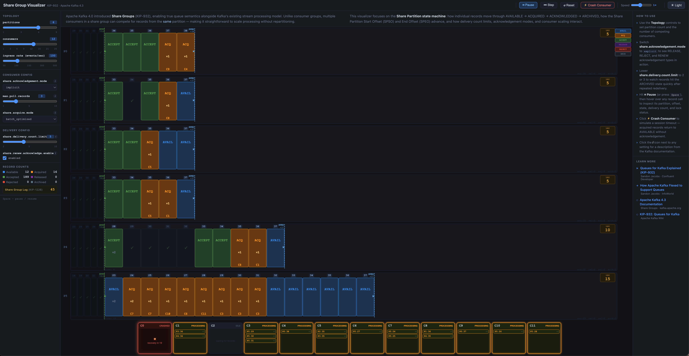
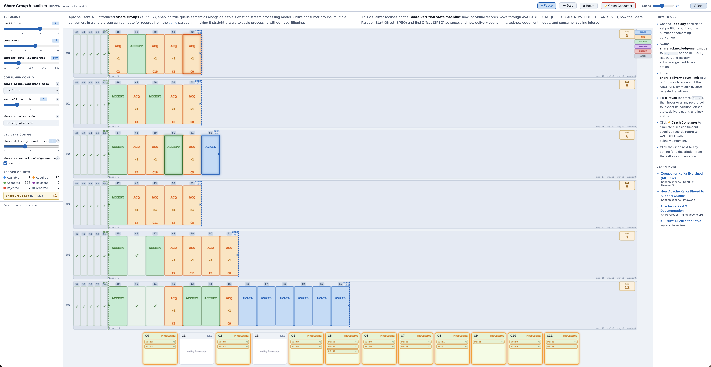

# Share Group Visualizer — KIP-932 · Apache Kafka 4.x

> **DEMO ONLY** — This is a browser-based simulation. It does not connect to a Kafka cluster, produce or consume real messages, or call any Kafka APIs. All behaviour is modelled locally in JavaScript to illustrate concepts.

An interactive visualizer for **Share Groups** (KIP-932), the queue semantics feature introduced in Apache Kafka 4.0. It lets you watch the Share Partition state machine in action, experiment with consumer scaling, and develop intuition for how acknowledgement modes and delivery limits interact — all without needing a running Kafka environment.

<table>
<tr>
<td align="center"> Dark mode</td>
<td align="center"> Light mode</td>
</tr>
</table>

## What it demonstrates

Share Groups allow multiple consumers to compete for records from the **same** partition, enabling true queue semantics alongside Kafka's existing stream processing model. This matters because traditional consumer groups hard-assign each partition to exactly one consumer — scaling requires more partitions. With share groups, you can add consumers without repartitioning.

The visualizer focuses on three areas:

**1. The Share Partition state machine**

Each record travels through a defined lifecycle:

| State | Meaning |
|---|---|
| **AVAILABLE** | Record is ready to be delivered to a consumer |
| **ACQUIRED** | A consumer has locked the record and is processing it |
| **ACKNOWLEDGED** | The consumer has settled the record (accepted, released, or rejected) |
| **ARCHIVED** | Record exceeded the delivery count limit — no further delivery attempts |

**2. The SPSO / SPEO offset markers**

- **SPSO** (Share Partition Start Offset) — the earliest offset of any live (AVAILABLE or ACQUIRED) record. The broker can only commit acknowledgements contiguously from this point.
- **SPEO** (Share Partition End Offset) — the latest produced offset of the in-flight records window.

**3. Consumer scaling without repartitioning**

You can add up to 25 consumers competing across 1–9 partitions and immediately see how work distributes. Records are delivered round-robin from SPSO forward; consumers that crash or time out return their acquired records to AVAILABLE state automatically.

## How to use it

Open `index.html` directly in any modern browser — no build step or server required.

### Controls

**Topology (left sidebar)**

| Control | What it does |
|---|---|
| `partitions` | Number of share partitions (1, 3, 6, or 9) |
| `consumers` | Number of competing consumers (1 – 25) |
| `ingress rate` | Simulated produce rate in events/sec (50 – 500) |

**Consumer Config**

| Setting | What it does |
|---|---|
| `share.acknowledgement.mode` | `implicit` — records auto-accepted on next `poll()`; `explicit` — consumers randomly emit ACCEPT, RELEASE, REJECT, or RENEW outcomes |
| `max.poll.records` | Max records fetched per consumer per poll call |
| `share.acquire.mode` | `batch_optimized` — broker may return fewer than max for efficiency; `record_limit` — strictly enforces the limit |

**Delivery Config**

| Setting | What it does |
|---|---|
| `share.delivery.count.limit` | Max times a record is redelivered before being ARCHIVED (2–10) |
| `share.renew.acknowledge.enable` | Allows consumers to extend their acquisition lock (RENEW ack type), only in EXPLICIT acknowledgement mode |

**Toolbar buttons**

| Button | Shortcut | Action |
|---|---|---|
| Pause / Resume | `Space` | Freeze or resume the simulation |
| Step | — | Advance one tick while paused (good for inspecting transitions) |
| Reset | — | Restart the simulation with current settings |
| Crash Consumer | — | Immediately crash a random active consumer; its acquired records return to AVAILABLE |
| Light / Dark | — | Toggle the colour theme |

**Inspecting records**

Pause the simulation, then hover over any record cell or consumer box. A tooltip shows the partition, offset, state, delivery count, lock expiry, and SPSO/SPEO values.

### Suggested experiments

1. **Scale consumers past partitions** — set partitions to 1, then slide consumers up to 9 or more. Multiple consumers compete for the same partition; watch how throughput scales without repartitioning.

2. **Trigger archiving** — set `share.delivery.count.limit` to 2, then switch `share.acknowledgement.mode` to `explicit`. Records that are repeatedly released or rejected quickly exhaust their delivery limit and enter ARCHIVED state.

3. **Watch RENEW in action** — with `explicit` mode and `share.renew.acknowledge.enable` on, some consumers will emit RENEW to extend their lock. The cell pulses with a white ring when a RENEW is sent.

4. **Simulate a consumer crash** — click **Crash Consumer** and watch all of that consumer's ACQUIRED records immediately revert to AVAILABLE for redistribution.

5. **Observe the SPSO gap** — lower the ingress rate and add consumers. Watch SPSO advance as records are accepted, and see how rejected or released records create gaps that block SPSO progress.

## Learn more

- [Queues for Kafka Explained (KIP-932)](https://www.youtube.com/watch?v=Wb0xyqgaIqw) — Sandon Jacobs, Confluent Developer
- [How Apache Kafka Flexed to Support Queues](https://www.infoworld.com/article/4143957/how-apache-kafka-flexed-to-support-queues.html) — Sandon Jacobs, InfoWorld
- [Apache Kafka 4.3 Documentation — Share Groups](https://kafka.apache.org/43/documentation/)
- [KIP-932: Queues for Kafka](https://cwiki.apache.org/confluence/display/KAFKA/KIP-932%3A+Queues+for+Kafka) — Apache Kafka Wiki
- Related KIPs referenced in the UI: KIP-1206 (batch_optimized acquire mode), KIP-1222 (RENEW acknowledgement), KIP-1226 (share group lag), KIP-1240 (delivery count limit bounds)
